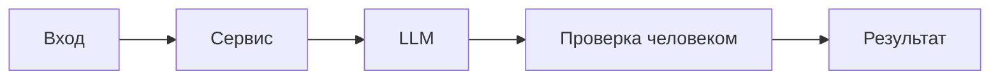

# ADR: решение для первого рабочего сценария

Файл ведёт OpenCode. Обсудите с агентом содержание и проверьте предложенный diff. Все дополнения и исправления поручайте агенту в чате.

- Статус: accepted
- Дата: 2026-09-20
- Ответственные: студент (ревьюер) / OpenCode (рабочий агент)

## Контекст

Нужно помочь ревьюеру PR быстро выделить риски и проверки по одному diff, не выходя за рамки входа. Важно обеспечить подтверждаемость выводов и воспроизводимость проверок.
## Решение

Для первой итерации применяем Master Prompt v1 с Context Pack: AI формирует Summary, ≤3 риска с file:line/start-end и доказательством, и Checks. Любые выводы должны ссылаться на diff или приводить воспроизводимую проверку. Язык ответа — русский.
## Рассмотренные альтернативы

| Альтернатива | Почему не выбрали сейчас |
|---|---|
| Сразу внедрять сложные правила (RAG, CoT) | Сложнее воспроизводимость, выше стоимость; для учебного кейса избыточно |
| Автоматизировать approve/merge | Противоречит границам задачи и ответственности человека |

## Последствия и главный риск

- Положительные последствия:
  - Повышение воспроизводимости и проверяемости ревью.
  - Ускорение первичного разбора diff.
- Ограничения:
  - Нет контекста вне diff; не извлекаем номера строк автоматически.
- Главный риск:
  - Недостаточная точность ссылок на строки (file:line/start-end могут отсутствовать).
- Как проверим риск:
  - Формальная проверка структуры и наличия ссылок в P1-02; ручная верификация по diff.

## Архитектурная схема

## Как использовали AI

- Для чего: обосновать и зафиксировать архитектурное решение для первого сценария (формат результата, границы действий, подтверждаемость выводов).
- Тип промпта: baseline zero-shot (P1-01) → master prompt (P1-02).
- Строка в [`prompts.md`](prompts.md): [P1-01](prompts.md#журнал-запросов-и-проверок), [P1-02](prompts.md#журнал-запросов-и-проверок).
- Что проверил студент и какие исправления поручил агенту: приняты замечания о валидации/обработке ошибок/схемах; отклонены выходы за рамки diff; зафиксирован русский язык ответа и структура Summary/Risks/Checks; отмечён риск отсутствия точных номеров строк и способ проверки по diff.
