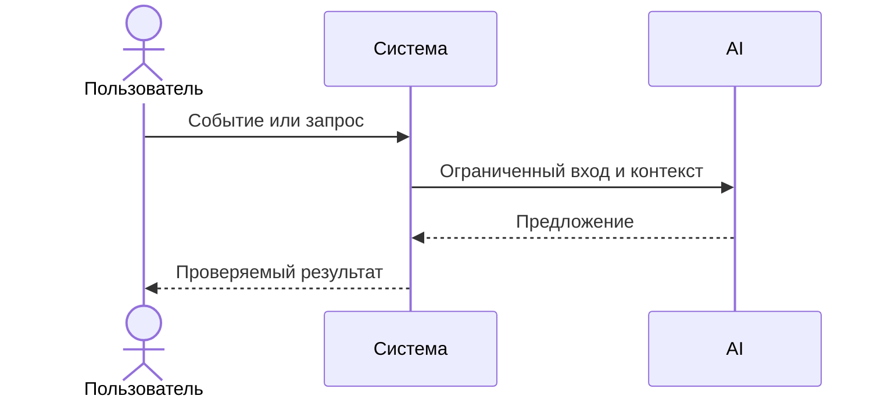

# Use cases и user stories

Файл ведёт OpenCode. Обсудите с агентом содержание и проверьте предложенный diff. Все дополнения и исправления поручайте агенту в чате.

## Первый рабочий сценарий

**Когда** ревьюер открывает PR и прикладывает diff, **система** (AI‑помощник) формирует краткое описание изменений, выделяет не более трёх рисков с указанием файла и строк и предлагает список проверок, **а пользователь получает** проверяемый набор подсказок для ревью.

Не входит в этот сценарий:

- approve/merge, изменение кода, выводы за пределами diff, внешние источники.

## Use case

| Поле | Значение |
|---|---|
| Актор | Ревьюер diff |
| Триггер | Получен diff одного PR |
| Предусловия | Доступен текстовый diff; модель vsellm/openai/gpt-5 |
| Основной результат | Summary; ≤3 риска с file:line/start-end и доказательством; Checks |
| Ошибка или отказ | Недостаточно подтверждений в diff — запросить уточнения у автора PR |



## User stories и acceptance criteria

```gherkin
Feature:
  As a ревьюер diff,
  I want получать краткое описание, ≤3 подтверждённых риска и список проверок,
  So that я быстрее и качественнее проведу первичный разбор PR.

  Scenario: Позитивный — валидный diff
    Given доступен валидный diff одного PR
    When помощник формирует ответ
    Then я вижу Summary
    And не более трёх Risks с file:line или file:start-end и доказательством
    And список Checks с воспроизводимыми шагами

  Scenario: Граничный — неполный diff
    Given diff неполный или неоднозначный
    When помощник не может подтвердить риск по diff
    Then риск должен содержать вопрос/уточнение или быть опущен
    And Checks должны оставаться воспроизводимыми
```

## Как использовали AI

- Для чего: описать первый сценарий и критерии приёмки.
- Тип промпта: master prompt (см. P1-02).
- Строка в [`prompts.md`](prompts.md): [P1-02](prompts.md#журнал-запросов-и-проверок).
- Что проверил студент и какие исправления поручил агенту: добавлена структура ответа и ограничения из Context Pack; зафиксирован отказ от действий за пределами diff.
