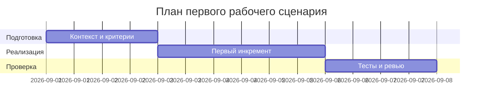

# План поставки

Файл ведёт OpenCode. Обсудите с агентом содержание и проверьте предложенный diff. Все дополнения и исправления поручайте агенту в чате.

## Инкременты и ответственность

| Инкремент | Наблюдаемый результат | Что делает человек | Что делает AI или субагент | Проверка | Зависимости |
|---|---|---|---|---|---|
| 1 | P1-01: baseline-ответ | Запускает эксперимент, оценивает | Генерирует вывод без контекста | Файл results/P1-01_zero_shot.md, запись в prompts.md | opencode.json, доступ к модели |
| 2 | Master Prompt v1 и Context Pack | Согласует форматы/границы | Собирает мастер-промпт | prompts.md (раздел Master Prompt v1) | context.md, problem.md |
| 3 | P1-02: ответ по промпту | Сверяет с форматом, оценивает | Генерирует структурированный вывод | results/P1-02_master_prompt_ru.md, запись в prompts.md | Инкремент 2 |

## Диаграмма Ганта

Передайте OpenCode даты и задачи своего плана и попросите обновить диаграмму.

## Как использовали AI

- Для чего: определить инкременты и артефакты поставки.
- Тип промпта: zero-shot → master prompt.
- Строка в [`prompts.md`](prompts.md): [P1-01](prompts.md#журнал-запросов-и-проверок), [P1-02](prompts.md#журнал-запросов-и-проверок).
- Что проверил студент и какие исправления поручил агенту: связность артефактов (context/problem → master prompt → результаты), воспроизводимость шагов.
